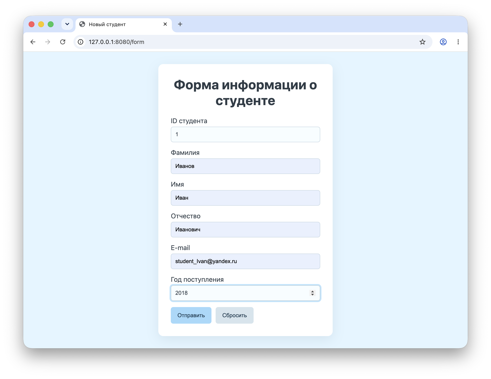
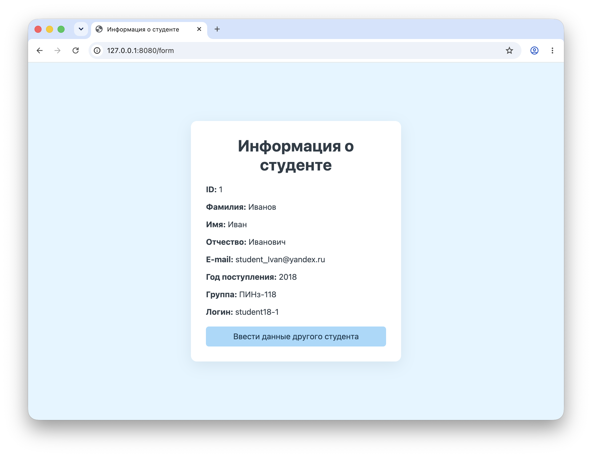

# Лабораторная работа №1

## Цель работы

Изучить работу Spring Boot на примере обработки данных с формы
## Архитектура проекта

- **Стек:** Java 21, Spring Boot 4.1.1, Spring Web MVC, Thymeleaf, Maven, HTML, CSS.

### Основные компоненты

- **Model — `Student.java`**

  Модель содержит данные студента: идентификатор, имя, фамилию, отчество, адрес электронной почты, год поступления, группу и логин.

- **View — `main-form.html` и `result.html`**

  HTML-шаблоны Thymeleaf отвечают за отображение формы ввода и результатов обработки данных.

- **Controller — `SimpleController.java`**

  Контроллер принимает GET- и POST-запросы, передаёт объект студента в форму, получает заполненные данные, формирует группу и логин, после чего открывает страницу результата.

- **Оформление — `style.css`**

  Таблица стилей отвечает за расположение формы, цвета, поля ввода и кнопки.


### Структура проекта

```text
src/
└── main/
    ├── java/
    │   └── ru/kafpin/lab1/
    │       ├── Lab1Application.java
    │       ├── SimpleController.java
    │       └── Student.java
    └── resources/
        ├── static/
        │   └── style.css
        ├── templates/
        │   ├── main-form.html
        │   └── result.html
        └── application.properties
```
## Скриншоты работы приложения

### Форма ввода



### Результат


